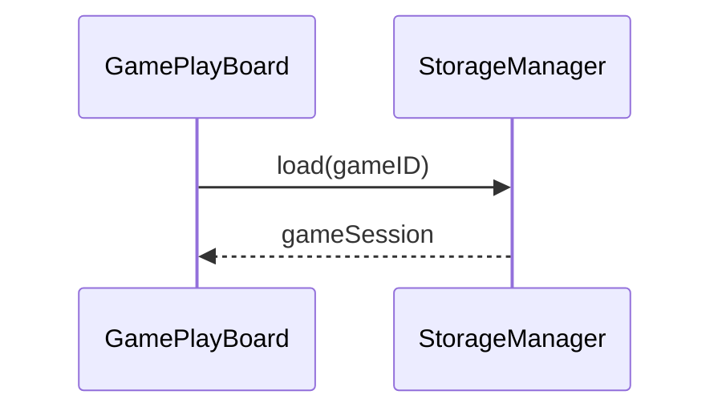
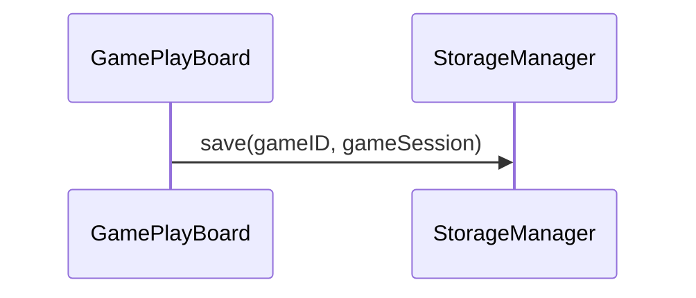

## Load a saved game 

```mermaid
sequenceDiagram
participant GamePlayBoard
participant StorageManager

GamePlayBoard->> StorageManager: load(gameID)
StorageManager-->>GamePlayBoard: gameSession
```

## Save current game

```mermaid
sequenceDiagram
participant GamePlayBoard
participant StorageManager
GamePlayBoard->> StorageManager: save(gameID, gameSession)
```

