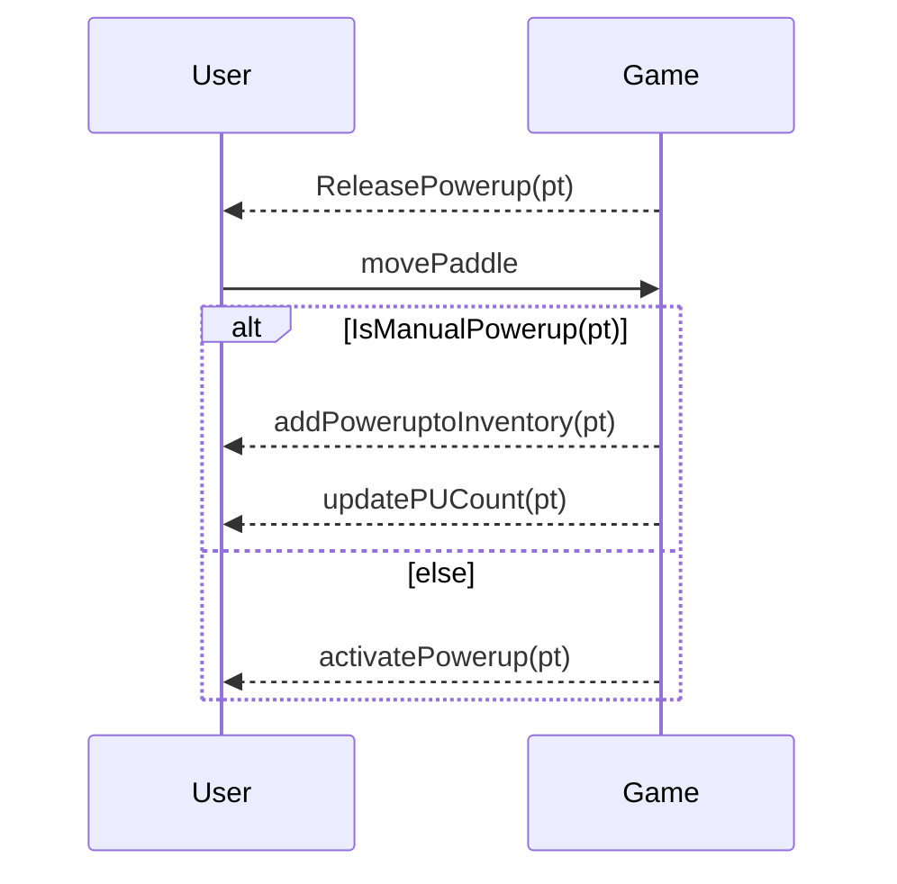

## Get Power-Up Game Sequence Diagram

```mermaid
sequenceDiagram
participant User
participant Game
Game-->>User: ReleasePowerup(pt)
User->> Game: movePaddle
alt IsManualPowerup(pt)
	Game-->>User: addPoweruptoInventory(pt)
	Game-->>User: updatePUCount(pt)
else else
	Game-->>User: activatePowerup(pt)
end
```

## Glossary 

* pt: power-up type : the type of power-up Use power up Game Sequence Diagram
