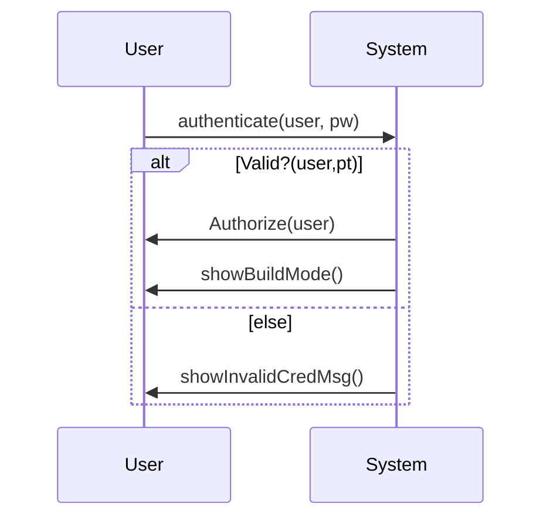

## Authenticate System Sequence Diagram

```mermaid
sequenceDiagram
participant User
participant System
User->> System: authenticate(user, pw)
alt Valid?(user,pt)
	System->>User: Authorize(user)
	System->>User: showBuildMode()
else else
	System->>User: showInvalidCredMsg()
end

```
## Glossary 

* user: username
* pw: Password