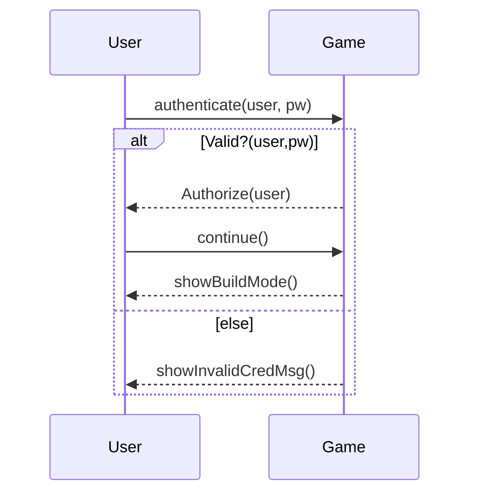

## Authenticate Game Sequence Diagram

```mermaid
sequenceDiagram
participant User
participant Game
User->> Game: authenticate(user, pw)
alt Valid?(user,pw)
	Game-->>User: Authorize(user)
	User->>Game: continue()
	Game-->>User: showBuildMode()
else else
	Game-->>User: showInvalidCredMsg()
end

```
## Glossary 

* user: username
* pw: Password