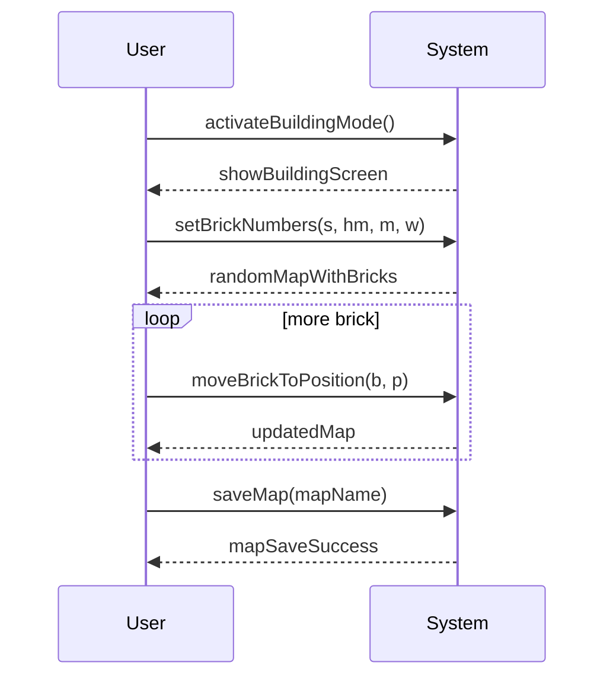

## Build a Map System Sequence Diagram

## Glossary 

* s: simple : number of simple brick
* hm: halfMetal : number of half-metal brick
* m: mine : number of mine brick
* w: wrapper : number of wrapper brick
* b: brick
* p: position