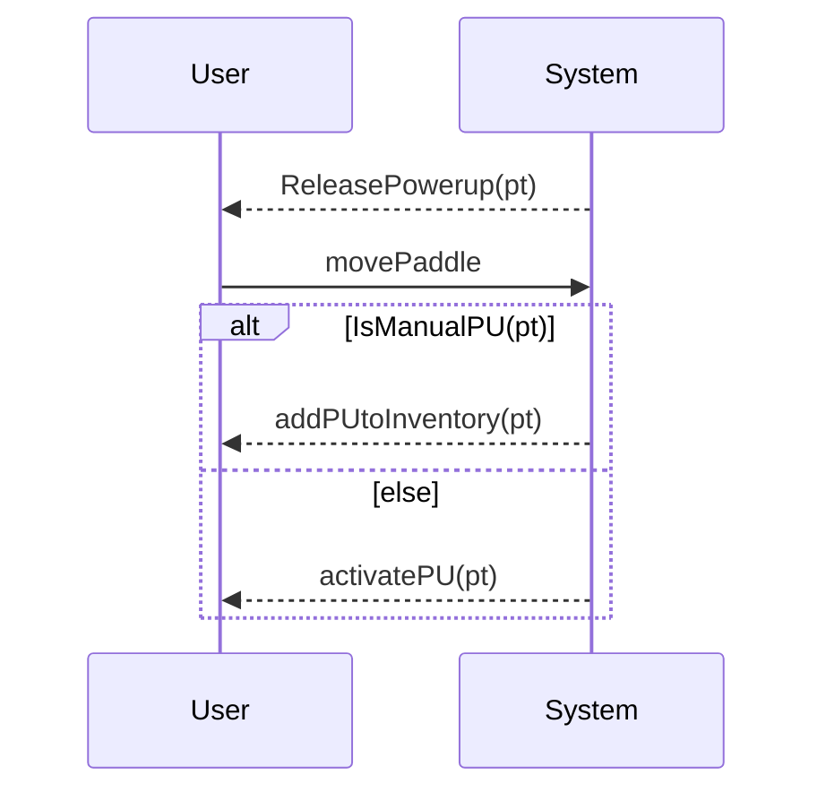

## Get Power-Up System Sequence Diagram

```mermaid
sequenceDiagram
participant User
participant System
System-->>User: ReleasePowerup(pt)
User->> System: movePaddle
alt IsManualPU(pt)
	System-->>User: addPUtoInventory(pt)
else else
	System-->>User: activatePU(pt)
end
```

## Glossary 

* pt: power-up type : the type of power-up
