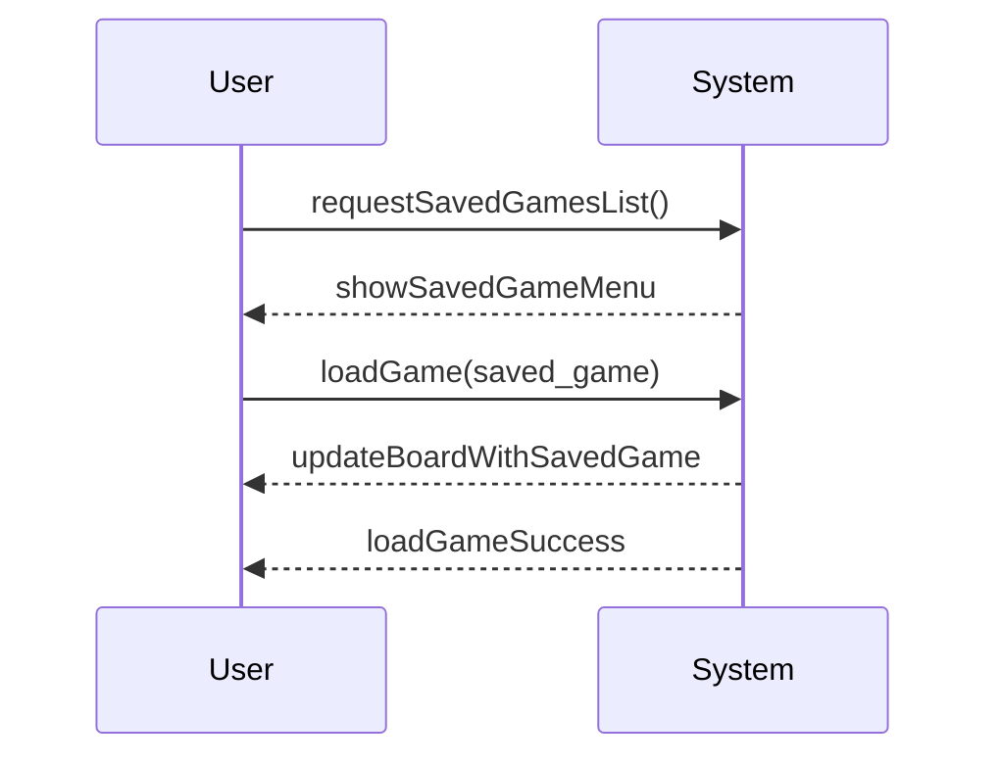

## Load a saved game System Sequence Diagram

```mermaid
sequenceDiagram
participant User
participant System
User->> System: requestSavedGamesList()
System-->>User: showSavedGameMenu
User->> System: loadGame(saved_game)
System-->>User: updateBoardWithSavedGame
System-->>User: loadGameSuccess
```
