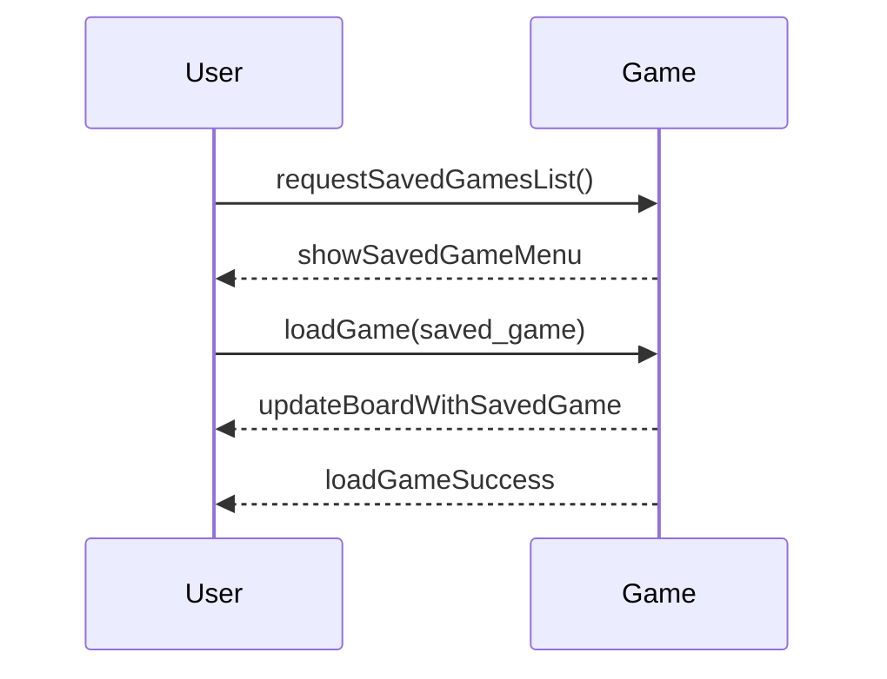

## Load a saved game Game Sequence Diagram

```mermaid
sequenceDiagram
participant User
participant Game
User->> Game: requestSavedGamesList()
Game-->>User: showSavedGameMenu
User->> Game: loadGame(saved_game)
Game-->>User: updateBoardWithSavedGame
Game-->>User: loadGameSuccess
```
