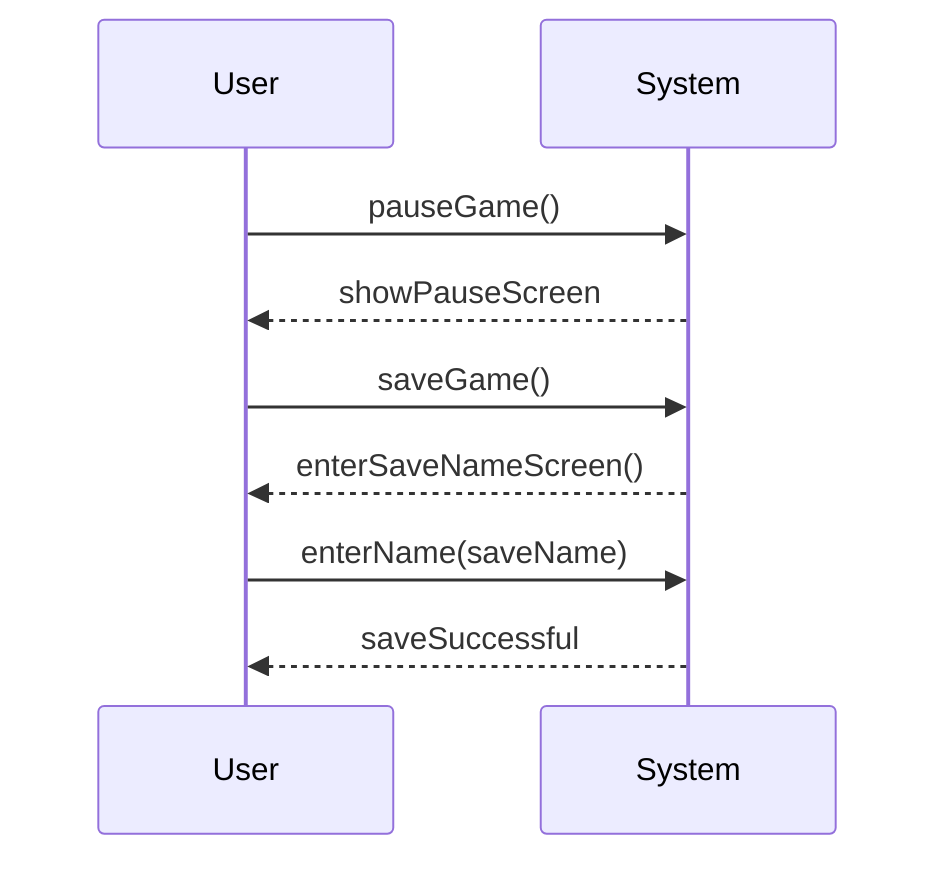

## Save the game System Sequence Diagram

```mermaid
sequenceDiagram
participant User
participant System
User->> System: pauseGame()
System-->>User: showPauseScreen
User->> System: saveGame()
System-->>User: enterSaveNameScreen()
User->> System: enterName(saveName)
System-->>User: saveSuccessful

```
## Glossary 

* saveName: name of the saved state
