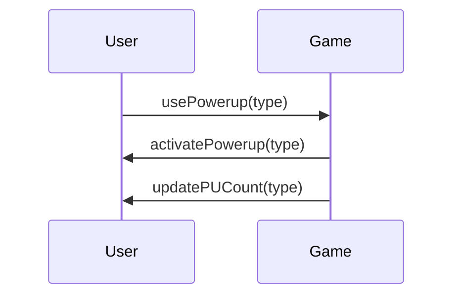

## Use power up Game Sequence Diagram

```mermaid
sequenceDiagram
participant User
participant Game
User->> Game: usePowerup(type)
Game->>User : activatePowerup(type)
Game->>User: updatePUCount(type)
```
